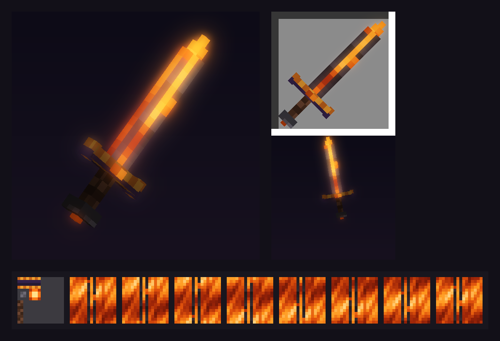
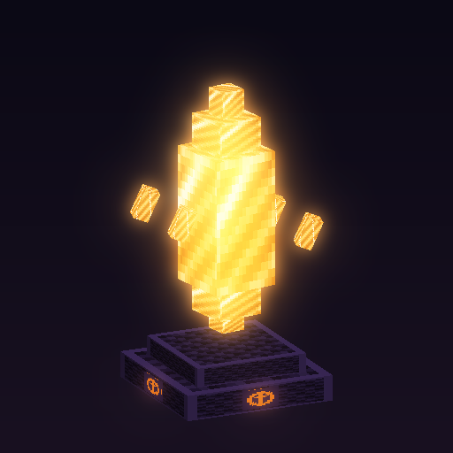

# Kaynak paketi (resource pack)

Sunucunun kendi eşyaları, zırhları, blokları ve modelleri burada üretilir. Oyuncular
paketi girişte otomatik indirir; mod kurmaları gerekmez.



## İlk eşya: Kor Kılıç

| Özellik | Nasıl yapıldı |
|---|---|
| 3B model (11 parça: bıçak, uç, koruma, kor taşları, sap, topuz) | `models/item/kor_kilic.json` |
| Akan magma bıçak (8 kare, yumuşak geçiş, ~1,2 sn döngü) | `kor_kilic_alev.png` + `.png.mcmeta` (`frametime: 3`, `interpolate: true`) |
| Karanlıkta parlayan bıçak ve taşlar | Model parçalarında `light_emission` (bıçak 15, taşlar 10–12) |
| Elde vanilla kılıç duruşu | `display` açıları vanilla `handheld` değerlerinden türetildi |
| Blockbench kaynağı (dokular gömülü) | `modeller/kor_kilic.bbmodel` |

Önizleme GIF'i (dönen model ve akan doku): [`onizleme/kor_kilic.gif`](onizleme/kor_kilic.gif).
Önizleme gerçek oyun görüntüsü değildir; oyunun okuyacağı dosyalardan basit bir çizimdir.

## Dizinler

| Yol | İçerik |
|---|---|
| `kaynak/` | Paketin kendisi (`pack.mcmeta` + `assets/kami/...`). Zip'e giren her şey burada |
| `modeller/` | Blockbench kaynak dosyaları (`.bbmodel`) |
| `araclar/kor_kilic.py` | Kor Kılıç'ın dokularını, modelini ve `.bbmodel` dosyasını üretir (yalnız Python) |
| `araclar/paketle.py` | Paketi doğrular ve `dist/kami-paket.zip` üretir; SHA-1'i yazar |
| `araclar/onizle.py` | Önizleme PNG/GIF'i çizer (Pillow + numpy ister; yalnız geliştirme aracı) |
| `bettermodel/` | BetterModel modelleri (`models/`, `players/`) ve steve kalıbı (`sablon/`) |
| `araclar/bettermodel.py`, `bb_denetle.py`, `bb_onizle.py` | BetterModel modellerini üretir / doğrular / önizler |
| `onizleme/` | Önizleme görselleri |
| `dist/` | Derleme çıktısı (git'e girmez) |

## Hemen deneme (kendi bilgisayarınızda)

1. Paketi oluşturun (depo kökünde):
   ```bash
   python3 paket/araclar/paketle.py
   ```
   Çıktı: `paket/dist/kami-paket.zip` ve `resource-pack-sha1=…` satırı.
2. Zip'i Minecraft'ın `resourcepacks` klasörüne kopyalayın
   (Windows: `%APPDATA%\.minecraft\resourcepacks`), oyunda **Seçenekler → Kaynak Paketleri**
   bölümünden etkinleştirin.
3. Hile açık bir dünyada ya da OP olduğunuz sunucuda kılıcı alın:
   ```
   /give @s minecraft:netherite_sword[minecraft:item_model="kami:kor_kilic",minecraft:custom_name={text:"Kor Kılıç",color:"#FF8A1F",italic:false},minecraft:lore=[{text:"Magmanın kalbinden dövüldü.",color:"gray",italic:false}],minecraft:rarity="epic"]
   ```
   Sunucu konsolundan veriyorsanız `@s` yerine oyuncu adını yazın (`/give Ahmet …`).

Görünüm yalnız paketle değişir; eşya yine de bir netherite kılıçtır (hasarı, dayanıklılığı
aynı). Özel hasar ve yetenekler sonraki adımda eklentiyle eklenecek.

Bu komut ve paket Minecraft 26.2 biçimine göre hazırlandı ama oyunda henüz denenmedi; ilk
denemede bir sorun görürseniz `latest.log` çıktısıyla birlikte bildirin.

## Blockbench'te açma ve düzenleme

1. [Blockbench](https://www.blockbench.net/) (ücretsiz; tarayıcı sürümü: web.blockbench.net)
   ile `paket/modeller/kor_kilic.bbmodel` dosyasını açın. Dokular dosyanın içindedir ve alev
   dokusu önizlemede akar.
2. Düzenledikten sonra **File → Export → Export Block/Item Model** ile modeli
   `paket/kaynak/assets/kami/models/item/kor_kilic.json` üzerine, değişen dokuları
   **Save As** ile `paket/kaynak/assets/kami/textures/item/` altına kaydedin.
3. `python3 paket/araclar/paketle.py` ile doğrulayıp yeniden paketleyin.

**Önemli:** `araclar/kor_kilic.py` çalıştırılırsa bu dosyaları baştan üretir ve elle yaptığınız
değişiklikler silinir. Kılıcı Blockbench'te düzenlemeye başladıysanız üreticiyi o eşya için
kullanmayı bırakın. Ayrıca `tests/test_paket.sh` içindeki "üretici ↔ depo" kontrolünü
kaldırın; bu kontrol elle yapılan değişikliği hata sayar.

## Yeni eşya ekleme (elle)

Her eşya için üç dosya yeterli:

```
kaynak/assets/kami/items/<ad>.json          {"model": {"type": "minecraft:model", "model": "kami:item/<ad>"}}
kaynak/assets/kami/models/item/<ad>.json    Blockbench'ten dışa aktarılan model
kaynak/assets/kami/textures/item/<ad>.png   doku (animasyon için kareleri alt alta + <ad>.png.mcmeta)
```

Oyunda herhangi bir eşyaya `minecraft:item_model="kami:<ad>"` bileşeni verilince yeni görünümü alır.

## Animasyonlu modeller ve emote'lar (BetterModel)

[BetterModel](https://github.com/toxicity188/BetterModel) (MIT, ücretsiz; Minecraft 1.21.4–26.3,
Java 25) Blockbench modellerini sunucu tarafında oynatır; paketini kendisi üretir. Oyuncuda mod gerekmez.



| Dosya | Ne | Animasyonlar |
|---|---|---|
| `bettermodel/models/kor_kristali.bbmodel` | Lobi süsü: obsidyen kaide + kor rünleri, dönüp süzülen parlayan kristal, ters yönde dönen 4 parça; dokusu 8 karelik akan ışıltı | `idle` (4 sn döngü, kendiliğinden oynar), `spawn` |
| `bettermodel/players/kami_emote.bbmodel` | Oyuncu emote'ları (oyuncunun kendi skin'iyle) | `selam`, `zafer`, `dans` (döngü) |

Önizlemeler: [kristal](onizleme/kor_kristali.gif) · [selam](onizleme/emote_selam.gif) ·
[zafer](onizleme/emote_zafer.gif) · [dans](onizleme/emote_dans.gif) ·
[kareler](onizleme/emote_onizleme.png). (Önizlemedeki oyuncu skin'i yalnız çizim içindir.)

**Sunucuya koyma** (BetterModel `config/plugins.list` ile backend'lere kurulur):

```bash
# lobby için (survival'a da aynı şekilde)
sudo -u minecraft mkdir -p /opt/minecraft/servers/lobby/plugins/BetterModel/{models,players}
sudo -u minecraft cp /opt/minecraft/kami/paket/bettermodel/models/*.bbmodel  /opt/minecraft/servers/lobby/plugins/BetterModel/models/
sudo -u minecraft cp /opt/minecraft/kami/paket/bettermodel/players/*.bbmodel /opt/minecraft/servers/lobby/plugins/BetterModel/players/
sudo mc cmd lobby "bettermodel reload"
```

**Oyunda deneme:**

```
/bettermodel spawn kor_kristali          # kristali bir varlığa takıp çağırır (idle kendiliğinden oynar)
/bettermodel test kor_kristali spawn     # belirli bir animasyonu dener
/bettermodel play kami_emote selam       # emote: selam | zafer | dans
```

**Kaynak paketi:** BetterModel kendi paketini `plugins/BetterModel/build.zip` olarak üretir. Oyuncuların
bu paketi de alması gerekir. Paket barındırma yöntemi seçilince bizim paketle birleştirilip tek adresten
verilecek (CraftEngine kullanılırsa BetterModel paketini kendisi birleştirir). O zamana kadar denemek için
`build.zip`'i istemcinin `resourcepacks` klasörüne kopyalayın.

**Kalıcı yerleşim:** Kristali lobide sabit durdurmak için BetterModel'in NPC entegrasyonları (FancyNpcs,
Citizens) ya da MythicMobs kullanılır; model adı `kor_kristali`.

**Kaynak ve yeniden üretme:** `araclar/bettermodel.py` (yalnız Python) iki dosyayı üretir,
`araclar/bb_denetle.py` doğrular, `araclar/bb_onizle.py` önizlemeleri çizer (Pillow + numpy).
Emote dosyası BetterModel'in `steve.bbmodel` kalıbı üzerine kuruludur
(`bettermodel/sablon/`, MIT lisansı: `bettermodel/sablon/LICENSE-BetterModel.md`).
Dosyalar Blockbench'te (Generic Model) açılıp düzenlenebilir; elle düzenlemeye başladıysanız üreticiyi o
dosya için kullanmayı bırakın (üretici üzerine yazar) ve `tests/test_paket.sh`'teki "üreticiyle aynı"
kontrolünü kaldırın.

**Bedrock:** Bedrock oyuncuları BetterModel modellerini varsayılan olarak görmez; bunun için
GeyserModelEngine + GeyserUtils gerekir (26.2 uyumluluğu henüz doğrulanmadı).

## Işıltı ve animasyon teknikleri

| Etki | Nasıl | Not |
|---|---|---|
| Akan / yanıp sönen doku | Kareleri alt alta dizip `.png.mcmeta` ile `frametime` + `interpolate` | Eşya, blok ve model dokularında çalışır |
| Karanlıkta parlama | Model parçasına `"light_emission": 0-15` | Yalnız o parça parlar; çevreyi aydınlatmaz |
| Büyü parıltısı (mor) | Eşyaya `minecraft:enchantment_glint_override=true` | Rengi değiştirilemez (shader gerekir) |
| Hareketli 3B model (dönen, süzülen, saldıran) | Blockbench animasyonu + BetterModel (yukarıda) | Eşya modelleri tek başına kemik animasyonu yapamaz |
| Parlayan model parçası (BetterModel) | Grup ya da küp adını `glow_` ile başlatın | Kor Kristali böyle parlar |

## Sürüm uyumluluğu

- `pack.mcmeta`: `min_format` 88 (Minecraft 26.2), `max_format` [97, 1] (26.3). Böylece 26.3
  istemcileri (ViaVersion ile giren) uyarı görmez.
- 26.3 model elemanlarındaki `shade` alanını kaldırdı; `paketle.py` bu alanı içeren modeli
  reddeder.
- Bedrock (Geyser) oyuncuları bu kılıcı normal netherite kılıç olarak görür. Java paketinin
  Bedrock'a çevrilmesi (GeyserMC Rainbow) ayrı bir adımdır.

## Sunucuda herkese otomatik gönderme (sonraki adım)

Paket bir web adresinden indirilebilir olmalı. Sonra lobi ve ana sunucunun
`server.properties` dosyasına şu ayarlar eklenir:

```
resource-pack=https://<adres>/kami-paket.zip
resource-pack-sha1=<paketle.py'nin yazdığı değer>
require-resource-pack=false
```

Barındırma yöntemi (VDS'te küçük bir web sunucusu mu, başka bir yer mi) henüz seçilmedi.
Seçilince `mc` komutuna otomatik yayınlama eklenecek.
